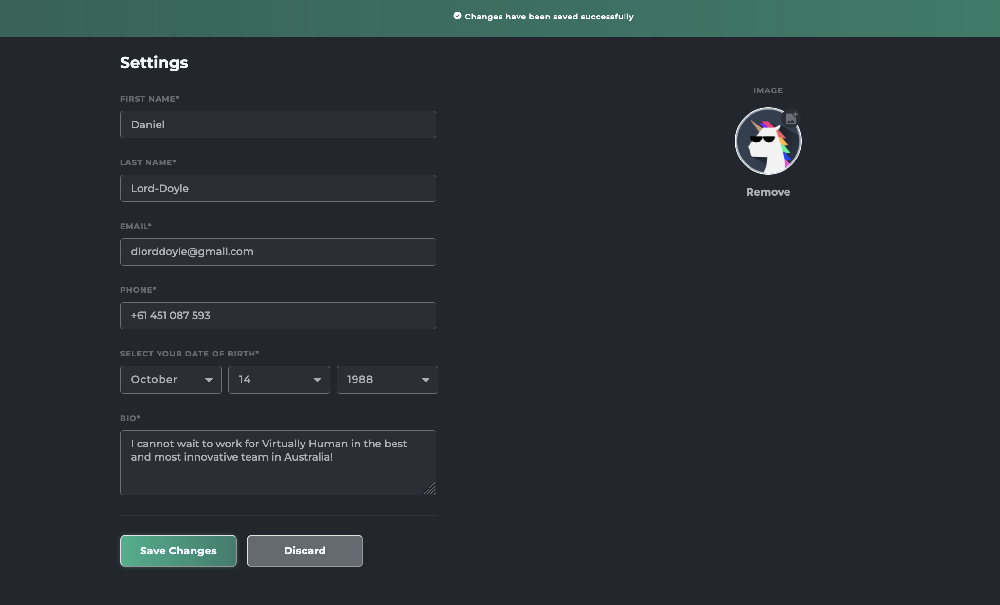
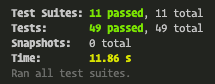

<p align="center"></p>

<p align="center">


</p>

<h1 align="center">Virtually Human - User Account Form</h1>

<p align="center">
  <a href="#conditions">Conditions</a> •
  <a href="#userstory">User Story</a> •
  <a href="#Improvements">Improvements</a> •
  <a href="#installation">Installation</a> •
  <a href="#testing">Testing</a> •
  <a href="#build">Build</a>
</p>

# `Conditions`

| Condition | Status | Notes
| --- | ----------- | --- |
| You must only use React.js and emotion for styling | true | Only pure CSS was used |
| You must not use any other UI libraries | true | No libraries were used |
| You must include a README.md file with instructions on how to install, build and run the app and how to run tests | true | This README.md includes all of that information |
You should include any unit tests that you deem approproate / necessary | true | 11 test suites, 49 tests |
| The solution interface should resemble the designs provided | true | As close as I could. Used Figma CSS for guidance |
| There should be no console error messages | true | Built a test utility that was attached to all tests that would throw an error on the test if a console error occured to ensure this was true |
| The codebase should use appropriate linting | true | Used ESLint |

## `Other features`

Whilst there is no true API, and the data doesn't persist, I enabled it so that the Save Changes button would print out a console log like this:

```js
bio: "I cannot wait to work for Virtually Human in the best and most innovative team in Australia!"
dob: Date Fri Oct 14 1988 00:00:00 GMT+1000 (Australian Eastern Standard Time)
email: "dlorddoyle@gmail.com"
firstName: "Daniel"
img: null
lastName: "Lord-Doyle"
phone: "+61 451 087 593"
```
Hopefully this helps you manually test the application if you'd like. *Note* This will not show in the testing environment as I applied an 'if' function that only runs the console.log if not a 'test' in a Node environment.

## `Screenshot`



# `UserStory`

| Condition | Status | Notes
| --- | ----------- | --- |
| The form is pre-populated with my details | true | n/a |
| The form contains all required editable fields | true | n/a |
| Date of birth: must be a datepicker | true | With the styling required, I built my own datepicker |
| Validations for fields must be met | true | They are also tested for, including valid email and phone no. |
| If user tabs away from an invalid field the field is highlighted with red and error message appears below | true | n/a |
| Once a user corrects the error and tabs/clicks away the error is removed | true | n/a |
| User can click on blank avatar, browse folders and upload an image which appears in the circle | true | n/a |
| Image upload: bonus points | true | You can drag and drop an image |
| If user clicks 'Remove' the image will reset to the default | true | n/a |
| If user clicks 'Save changes' a toast notification will let them know the submit was successful | true | n/a |

# `Improvements`
- Convert from raw CSS to inline-styling and nested selectors through Emotion
- Mobile optimise styling
- Make it so that date picker fields can be opened by clicking Enter when tabbed over and dropdown arrow keyed through
- Ensure compatability for older browsers & test for compatibility
# `Installation`

I didn't know how deep you wanted me to go on this, so I have provided some basic instructions for someone who may not be familiar with GitHub.

1. Install [Homebrew](https://brew.sh/)
2. Open your terminal and install Git using Homebrew:
```
$ brew install git
```
3. Verify the installation was successful by typing which git --version:
```
$ git --version git version 2.9.2
```
4. Navigate to a relevant folder that you would like to contain your version of the app and type
``` 
git clone https://github.com/thelorddoyle/virtually-human-form.git 
```
5. (Optional) Alternatively you can [download the zip of the project here](https://github.com/thelorddoyle/virtually-human-form/archive/refs/heads/main.zip).
6. You should now see the 'virtually-human-form' directory in your chosen folder. Type the following:
``` 
cd virtually-human-form/
```
7. You are now inside the project! We now need to install the dependencies by typing:
```
npm install 
```
8. Finally, let's get the app up and running. Type the following:
```
npm start
```
**You have successfully installed the app! Simply wait for the app to start & open [http://localhost:3000](http://localhost:3000)**

# `Testing`



If you would like to run the entire suite of tests, open your terminal whilst in the app folder and type:

```
npm test
```

This launches the test runner in the interactive watch mode, where you can also choose from options as to which tests you would like to watch / run.

If you would like to run a specific test, type:
```js
npm test -- {insert test file name} (or at least enough so that it is unique)

Example:

npm test -- datePick
(the above line will run the DatePicker.test.js file)
```

## `Available test suites`
 -  src/App.test.js
 -  src/components/Form.test.js
 -  src/components/formComponents/FirstName/FirstName.test.js
 -  src/components/formComponents/LastName/LastName.test.js
 -  src/components/formComponents/Email/Email.test.js
 -  src/components/formComponents/Phone/Phone.test.js
 -  src/components/formComponents/DatePicker/DatePicker.test.js
 -  src/components/formComponents/Bio/Bio.test.js
 -  src/components/formComponents/ImageUpload/ImageUpload.test.js
 -  src/components/formComponents/Buttons/Buttons.test.js
 -  src/components/formComponents/SuccessBanner/SuccessBanner.test.js
## `What does the test suite test for?`
Prior to this coding assessment, I have never used React testing so I really enjoyed learning about how the React Testing Library works and what the best practices are for RTL.

The tests check that every component renders, that it renders correctly and that each component of the form that takes user interaction works as it should under a range of conditions.

## `Example test`

```js
    it('will correctly render 29 days in February if it is a leap year', async () => {
        setupTest()

        const user = userEvent.setup()

        // choose February as a month
        const monthButton = screen.getByTestId('monthButton');
        await user.click(monthButton)
        const differentMonth = screen.getByText(/february/i)
        await user.click(differentMonth)
        expect(monthButton).toHaveTextContent(/february/i);

        // choose 2020 as a year (which was a leap year)
        const yearButton = screen.getByTestId('yearButton');
        await user.click(yearButton)
        const leapYear = screen.getByText(/2020/i)
        await user.click(leapYear)
        expect(yearButton).toHaveTextContent(/2020/i);

        // try to get the 29th day in February which is only available on a leap year
        const dayButton = screen.getByTestId('dayButton');
        await user.click(dayButton)
        const theleapday = screen.getByText(/29/i)
        await user.click(theleapday)
        expect(dayButton).toHaveTextContent(/29/i);
    })
```

## `No console errors`

To ensure that no console errors could possibly appear I built a test utility that ran in all of the test files to ensure that a test would be thrown if **any** console errors occured.

```js
import sinon from 'sinon';

export function noErrorsAllowed() {
    beforeEach(() => {
      sinon.stub(console, 'error');
    });
  
    afterEach(() => {
      sinon.assert.notCalled(console.error);
      console.error.restore();
    });
  }
```

# `Build`

Once the app has been tested, in the terminal type:

```
npm run build
```

The build is minified and the filenames include the hashes and is ready to be deployed.

For the purpose of this exercise, I installed serve and hosted the app on my own localhost.

To do this, type:

```
npm install -g serve
serve -s build
```

If you like, the port can be adjusted:

```
serve -s build -l 4000
OR
serve -h (for all of your options)
```

Thank you for your consideration. I've had loads of fun doing this exercise and learnt loads!